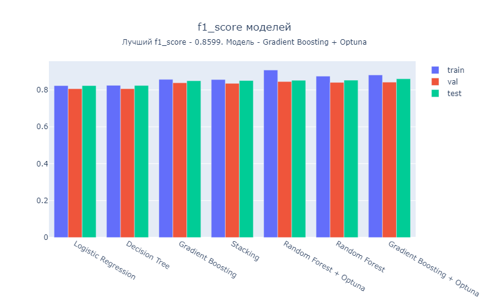
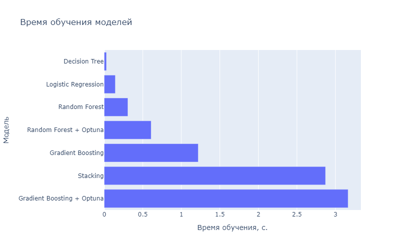

# Классификация клиентов банка

## Содержание
[1. Цель проекта](#цель-проекта) \
[2. Описание данных](#описание-данных) \
[3. Ответы на вопросы бизнеса](#ответы-на-вопросы-бизнеса) \
[4. Основные шаги](#основные-шаги) \
[5. Результаты](#результаты)

## Цель проекта

Цель проекта: построение модели машинного обучения, которая на основе предложенных характеристик клиента предсказывает, воспользуется он предложением об открытии депозита или нет.

## Описание данных

Данные о клиентах банка:

- age - возраст;
- job - сфера занятости;
- marital - семейное положение;
- education - уровень образования;
- default - имеется ли просроченный кредит;
- housing - имеется ли кредит на жильё;
- loan - имеется ли кредит на личные нужды;
- balance - баланс.

Данные, связанные с последним контактом в контексте текущей маркетинговой кампании:

- contact - тип контакта с клиентом;
- month - месяц, в котором был последний контакт;
- day - день, в который был последний контакт;
- duration - продолжительность контакта в секундах.

Прочие признаки:

- campaign - количество контактов с этим клиентом в течение текущей кампании;
- pdays - количество пропущенных дней с момента последней маркетинговой кампании до контакта в текущей кампании;
- previous - количество контактов до текущей кампании;
- poutcome - результат прошлой маркетинговой кампании.

Целевая переменная **deposit** определяет, согласится ли клиент открыть депозит в банке.

## Ответы на вопросы бизнеса

1. Q: Для какого статуса предыдущей маркетинговой кампании успех в текущей превалирует над количеством неудач? \
A: Успех в текущей маркетинговой кампании превалирует над количеством неудач для успешного статуса предыдущей.
2. Q: В каком месяце чаще всего отказывались от предложения открыть депозит? \
A: Чаще всего клиенты отказывалиь от предложения в мае месяце.
3. Q: В каких возрастных группах более склонны открывать депозит, чем отказываться от предложения? \
A: Клиенты в возрастных группах "60+" и "<30" более склонны открывать депозит чем отказываться.
4. Q: Люди с каким образованием и семейным статусом наиболее склонны открыть депозит? \
A: Люди с высшим образованием и вне брака наиболее склонны открыть депозит.

## Основные шаги
1) Загрузка данных;
2) Предобработка данных:
    - Обработка пропусков;
    - Удаление дубликатов.
3) Разведывательный анализ:
    - Визуализация;
    - Проектирование признаков.
4) Преобразование данных:
    - Кодирование;
    - Удаление выбросов;
    - Отбор признаков;
    - Нормализация и стандартизация.
5) Обучение;
6) Вывод результатов.

## Результаты

В таблице приведены значения метрики f1_score, полученных после обучения на разных моделях:
|                            |   train     |   valid     |   test     |
|----------------------------|-------------|-------------|------------|
| Gradient Boosting + Optuna |   **0.881** |   0.842     |  **0.86**  |
| Random Forest              |   0.874     |   0.841     |  0.852     |
| Random Forest + Optuna     |   0.908     |   **0.845** |  0.852     |
| Stacking                   |   0.856     |   0.835     |  0.851     |
| Gradient Boosting          |   0.857     |   0.838     |  0.849     |
| Decision Tree              |   0.825     |   0.806     |  0.824     |
| Logistic Regression        |   0.823     |   0.806     |  0.823     |

В результате, по точности, лучшим решением для данной задачи является Gradient Boosting с подбором гиперпараметров с помощью Optuna. 